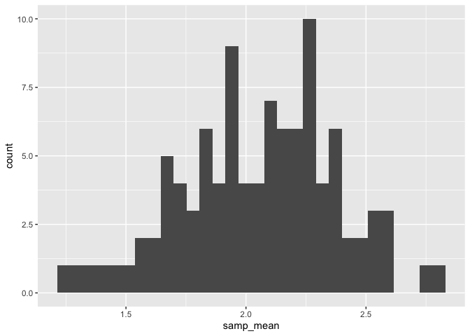
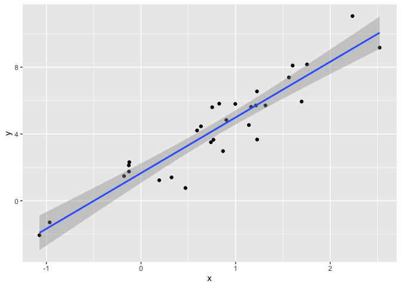
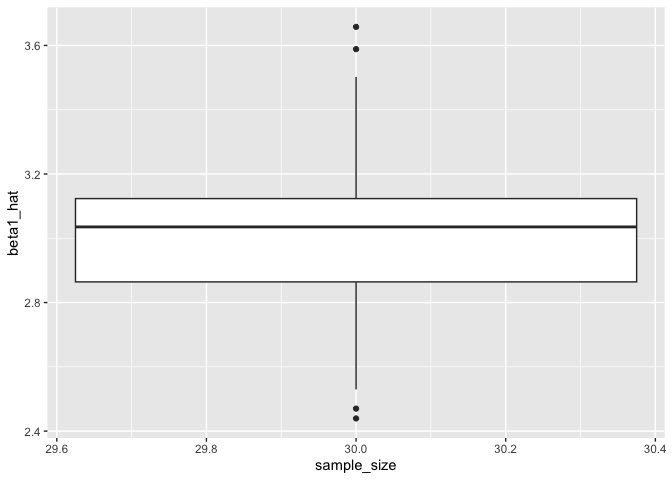

simulation
================
Kimberly Lopez
2024-10-31

**Example**

``` r
library(tidyverse)
```

    ## ── Attaching core tidyverse packages ──────────────────────── tidyverse 2.0.0 ──
    ## ✔ dplyr     1.1.4     ✔ readr     2.1.5
    ## ✔ forcats   1.0.0     ✔ stringr   1.5.1
    ## ✔ ggplot2   3.5.1     ✔ tibble    3.2.1
    ## ✔ lubridate 1.9.3     ✔ tidyr     1.3.1
    ## ✔ purrr     1.0.2     
    ## ── Conflicts ────────────────────────────────────────── tidyverse_conflicts() ──
    ## ✖ dplyr::filter() masks stats::filter()
    ## ✖ dplyr::lag()    masks stats::lag()
    ## ℹ Use the conflicted package (<http://conflicted.r-lib.org/>) to force all conflicts to become errors

``` r
set.seed(1)
```

## Simulation: Mean and SD for one 𝑛

``` r
sim_df = 
  tibble(
    x=rnorm(30,10,5)
  )

sim_df|>
  summarize(
    mean= mean(x),
    sd= sd(x)
  )
```

    ## # A tibble: 1 × 2
    ##    mean    sd
    ##   <dbl> <dbl>
    ## 1  10.4  4.62

We will be using the function;

``` r
sim_mean_sd = function(n, mu = 2, sigma = 3) {
  
  sim_data = 
    tibble(
    x = rnorm(n, mean = mu, sd = sigma),
  )
  
  sim_data |> 
    summarize(
      samp_mean = mean(x),
      samp_sd = sd(x)
    )
}
```

Lets run a simulation 100 times to see if this will actually be a normal
distribution

- since we had a list of dataframes, we could use Bind() to combine them
  all with each row being an entry
- we can also summarize on these inputs to take the average mean and sd
  for all 100 samples

``` r
output = vector("list", 100)

for (i in 1:100) {
  output[[i]] = sim_mean_sd(30)
}

sim_results = bind_rows(output)|>
  summarize(
    av_samp_mean = mean(samp_mean),
    SE_samp_mean = sd(samp_mean)
  )
sim_results
```

    ## # A tibble: 1 × 2
    ##   av_samp_mean SE_samp_mean
    ##          <dbl>        <dbl>
    ## 1         1.98        0.577

**we can do the same thing using mapping instead of a forloop to do
this**

- first create a df to keep all the data
- map over an iteration
- we use mutate to update our empty tibble with these results

``` r
sim_results= 
  tibble(
    iter = 1:100
  )|>
  mutate(samp_results = map(iter , sim_mean_sd, n= 30))|>
  unnest(samp_results)

sim_results
```

    ## # A tibble: 100 × 3
    ##     iter samp_mean samp_sd
    ##    <int>     <dbl>   <dbl>
    ##  1     1      1.47    3.11
    ##  2     2      3.39    3.22
    ##  3     3      3.24    2.97
    ##  4     4      4.61    3.72
    ##  5     5      4.37    3.06
    ##  6     6      7.25    2.67
    ##  7     7      7.06    3.09
    ##  8     8      8.27    2.99
    ##  9     9      9.46    3.57
    ## 10    10     10.1     3.26
    ## # ℹ 90 more rows

**We can try different sample size using \`expand_grid()**

- the list of inputs into our function they will iterate through the
  different sample sizes n

``` r
sim_results= 
  expand_grid(
    n= c(10,30,60,100),
    iter= 1:100
  )|>
  mutate(samp_results= map(n,sim_mean_sd))|>
  unnest(samp_results)

sim_results
```

    ## # A tibble: 400 × 4
    ##        n  iter samp_mean samp_sd
    ##    <dbl> <int>     <dbl>   <dbl>
    ##  1    10     1     1.19     3.12
    ##  2    10     2     2.29     3.45
    ##  3    10     3     4.39     3.23
    ##  4    10     4     0.524    1.90
    ##  5    10     5     2.34     2.79
    ##  6    10     6     1.88     2.78
    ##  7    10     7     0.306    2.35
    ##  8    10     8     3.35     5.00
    ##  9    10     9     2.58     3.82
    ## 10    10    10     1.83     3.45
    ## # ℹ 390 more rows

Now we can `group_by` n and summarize the stanadrd error of the sample
mean

``` r
sim_results |> 
  group_by(n)|>
  summarize(
    se= sd(samp_mean)
  )
```

    ## # A tibble: 4 × 2
    ##       n    se
    ##   <dbl> <dbl>
    ## 1    10 0.982
    ## 2    30 0.536
    ## 3    60 0.337
    ## 4   100 0.323

**we can also visualize these results**

-\> used a histogram since a `violin` requires you to have a factor
variable

``` r
sim_results|> 
  filter(n==100)|>
  ggplot(aes(x=samp_mean))+
  geom_histogram()
```

    ## `stat_bin()` using `bins = 30`. Pick better value with `binwidth`.

<!-- -->

``` r
sim_results|> 
  mutate(
    n= str_c("n = ", n),
    n = fct_inorder(n))|> 
  ggplot(as(x = n, y = samp_mean)) +
  geom_violin()
```

# Simple Linear Regression

``` r
 sim_data= 
  tibble(
    x= rnorm(30, mean = 1, sd= 1),
    y = 2+3*x+rnorm(30,0,1)
  )

sim_data|>
  ggplot(aes(x=x, y=y))+
  geom_point()+
  stat_smooth(method="lm")
```

    ## `geom_smooth()` using formula = 'y ~ x'

<!-- -->

``` r
lm_fit= lm(y~x, data= sim_data)
```

**We can turn this into a function that returns the coefficents output**

- `coef(lm_fit[index#])` will give you the beta coefficents

``` r
sim_regression = function (n){
  
  sim_data= 
  tibble(
    x= rnorm(n, mean = 1, sd= 1),
    y = 2+3*x+rnorm(n,0,1)
  )
  
  lm_fit = lm(y~x, data = sim_data)
  
  out_df = 
    tibble( 
      beta0_hat = coef(lm_fit)[1],
      beta1_hat = coef(lm_fit)[2])
  return(out_df)
}
```

Now we can run this function over many

``` r
sim_results = 
  expand_grid(
    sample_size = 30 , 
    iter= 1:100
  )|>
  mutate(lm_res = map(sample_size, sim_regression))|>
  unnest(lm_res)

head(sim_results)
```

    ## # A tibble: 6 × 4
    ##   sample_size  iter beta0_hat beta1_hat
    ##         <dbl> <int>     <dbl>     <dbl>
    ## 1          30     1      1.54      3.13
    ## 2          30     2      1.83      3.03
    ## 3          30     3      2.08      3.03
    ## 4          30     4      2.26      2.81
    ## 5          30     5      2.29      3.12
    ## 6          30     6      1.75      3.06

``` r
sim_results|>
  mutate(sample_sez= str_c("n = ", sample_size)) |>
  ggplot(aes(x= sample_size, y = beta1_hat))+ 
  geom_boxplot()
```

<!-- -->

## Birthday Problem

``` r
bday_sim = function(n){
  bdays= sample( 1:365, size = 10, replace= TRUE)
  
  duplicate = length(unique(bdays))<10
  
  return(duplicate)
}

bday_sim(10)
```

    ## [1] FALSE

`map_lgl` gives you the logical return

- we can use code to get the average of true or false based on sample
  size
- exapand grid helps us iterate the map function to simulate

``` r
sim_results = 
  expand_grid(
    n= c(10,50),
    iter= 1:100
  )|>
  mutate(res = map_lgl(n, bday_sim))|>
  group_by(n)|>
  summarize(prob = mean(res))

sim_results
```

    ## # A tibble: 2 × 2
    ##       n  prob
    ##   <dbl> <dbl>
    ## 1    10  0.16
    ## 2    50  0.15
